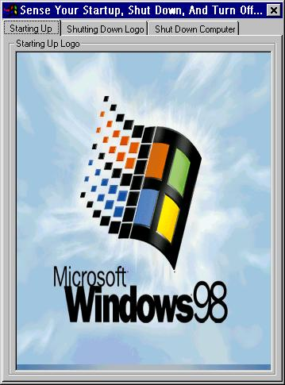



## Sense The Splash Screens Used By Windows

### Description

This program is a simple application that is designed for one

thing and one thing only: It senses the "Splash Screens" used

by Windows when you start up your computer, the computer is in

the process of shutting down, and when Windows prompts you "It

Is Now Safe To Turn Off Your Computer," or whatever you have

it set to. This program allows you to copy those images to the

clipoard, as well as "Refresh" them. If for no other reason,

check this program out to learn what files Windows uses for

the pictures behind the splash screens, and how to load pictures

into pictureboxs/images on runtime, a function that is VERY

helpful when skinning. This could be useful for people attempting

to make their own themes. By using the knowledge that I gained

from this application, I wrote a program that changes those

screens to some special files that I made.

P.S. Throw a vote in my direction if you can find the time: You

have no idea how long it took me poking around in my hard drive

to find these files, and to figure out how to load pictures on

runtime. And for those of you wondering how you load pictures

on runtime, this is the simplest code available.

Example:

Private Sub Form_Load()

Picture1.Picture = LoadPicture("C:\Windows\Bubbles.bmp")

End Sub
 
### More Info
 

             |
---                |---
**Submitted On**   |2001-08-28 18:20:54
**By**             |[Slippah](https://github.com/Planet-Source-Code/PSCIndex/blob/master/ByAuthor/slippah.md)
**Level**          |Beginner
**User Rating**    |4.4 (22 globes from 5 users)
**Compatibility**  |VB 6\.0
**Category**       |[Files/ File Controls/ Input/ Output](https://github.com/Planet-Source-Code/PSCIndex/blob/master/ByCategory/files-file-controls-input-output__1-3.md)
**World**          |[Visual Basic](https://github.com/Planet-Source-Code/PSCIndex/blob/master/ByWorld/visual-basic.md)
**Archive File**   |[Sense The 255398292001\.zip](https://github.com/Planet-Source-Code/slippah-sense-the-splash-screens-used-by-windows__1-26774/archive/master.zip)

